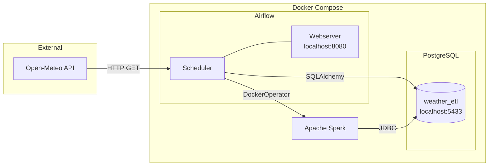
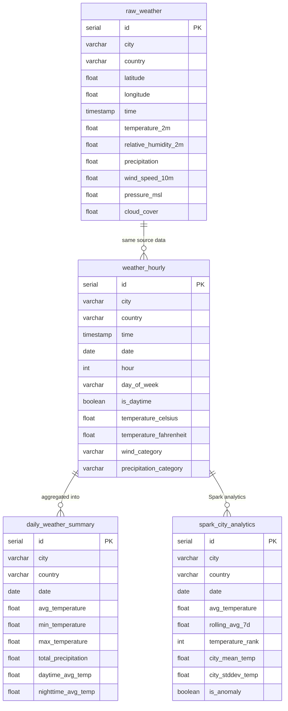

# Weather ETL Pipeline

End-to-end ETL pipeline that extracts weather data from the [Open-Meteo API](https://open-meteo.com/) for 10 European cities, transforms and enriches it in Python, loads it into PostgreSQL, and runs advanced analytics with Apache Spark — orchestrated with Apache Airflow.

## Architecture



### Data Flow


## Data Source

[Open-Meteo Archive API](https://open-meteo.com/) — free, no API key required. Historical and current hourly weather data for:

Belgrade, Zagreb, Budapest, Vienna, Ljubljana, Bucharest, Sofia, Bratislava, Prague, Berlin

**Variables collected:** temperature, humidity, precipitation, wind speed, pressure, cloud cover.

## Tech Stack

| Component | Technology |
|-----------|-----------|
| Language | Python 3.11 |
| Database | PostgreSQL 15 |
| Orchestration | Apache Airflow 2.10 |
| Containerization | Docker / Docker Compose |
| Data Processing | Apache Spark (PySpark) |
| Libraries | pandas, SQLAlchemy, requests |

## Pipeline Tasks

The Airflow DAG (`weather_etl_pipeline`) runs 7 sequential tasks:


| # | Task | Description |
|---|------|-------------|
| 1 | `extract_data` | Fetch 7 days of hourly weather data for 10 cities from Open-Meteo API |
| 2 | `transform_data` | Flatten JSON, rename columns, add derived fields (day/night, wind category, Fahrenheit) |
| 3 | `create_tables` | Create PostgreSQL tables if they don't exist |
| 4 | `load_to_postgres` | Insert data into `raw_weather` and `weather_hourly` tables |
| 5 | `compute_daily_summary` | SQL aggregation into `daily_weather_summary` (avg/min/max temp, total precipitation) |
| 6 | `quality_check` | Validate that tables are not empty |
| 7 | `spark_analytics` | PySpark job: rolling averages, city rankings, anomaly detection via JDBC |

## Database Schema



**`raw_weather`** — raw API data with original column names

**`weather_hourly`** — enriched hourly data with derived fields (day/night flag, wind category, Fahrenheit, etc.)

**`daily_weather_summary`** — aggregated daily stats per city (avg/min/max temp, total precipitation, daytime vs nighttime)

**`spark_city_analytics`** — Spark-computed analytics: 7-day rolling average, daily city temperature ranking, anomaly detection

## Project Structure

```
├── dags/
│   └── weather_etl_dag.py        # Airflow DAG definition
├── src/
│   ├── config.py                 # Database connection config
│   ├── extract/
│   │   └── weather_api.py        # Open-Meteo API extraction
│   ├── transform/
│   │   └── weather_transform.py  # Data cleaning and enrichment
│   ├── load/
│   │   └── db_loader.py          # PostgreSQL loading
│   └── spark/
│       └── weather_analytics.py  # PySpark analytics job
├── sql/
│   ├── create_tables.sql         # DDL for all tables
│   └── init_db.sql               # Creates weather_etl database
├── tests/
│   ├── test_extract.py           # Extract module tests
│   └── test_transform.py         # Transform module tests
├── docker-compose.yml
├── Dockerfile                    # Airflow image
├── Dockerfile.spark              # Spark image with JDBC driver
├── requirements.txt
└── requirements-airflow.txt
```

## Getting Started

### Prerequisites

- Docker and Docker Compose
- Python 3.9+ (for running tests locally)

### Run the pipeline

```bash
# Build and start all services (PostgreSQL, Airflow, Spark)
docker compose up -d --build
docker compose --profile spark build spark

# Open Airflow UI
open http://localhost:8080
# Login: admin / admin

# Trigger the pipeline manually from the UI,
# or wait for the daily schedule
```

### Run tests locally

```bash
python3 -m venv venv
source venv/bin/activate
pip install -r requirements.txt
pip install pytest

pytest tests/ -v
```

### Connect to the database

```
Host: localhost
Port: 5433
Database: weather_etl
User: airflow
Password: airflow
```

## Screenshots

*Screenshots of the running pipeline:*


## Data Analysis

See the [Weather Analysis Notebook](notebooks/weather_analysis.ipynb) for visualizations including:
- Average temperature comparison across cities
- Temperature trends over time
- Precipitation analysis
- Daytime vs nighttime temperature comparison
- Correlation heatmap between weather variables
- Wind category distribution

## Key Design Decisions

- **Idempotent loads**: `ON CONFLICT DO NOTHING` on insert — pipeline can be re-run safely without duplicating data
- **Upsert for summaries**: `ON CONFLICT DO UPDATE` on daily_weather_summary — always reflects the latest computation
- **Raw + enriched tables**: raw_weather preserves original API data; weather_hourly has the transformed version
- **No external API key**: Open-Meteo is free and keyless — anyone can clone and run the pipeline immediately
- **Spark via DockerOperator**: Airflow launches PySpark jobs in isolated containers, reading/writing PostgreSQL via JDBC — mirrors production patterns where Spark runs on separate infrastructure
